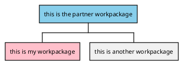
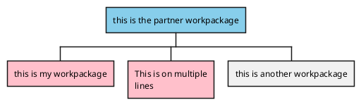

[UP](/plantuml/plantuml-index.html)

## Inline Color

```text
@startwbs
*[#SkyBlue] this is the partner workpackage
**[#pink] this is my workpackage
** this is another workpackage
@endwbs
```



## Style Color

```text
@startwbs
<style>
wbsDiagram {
  .pink {
      BackgroundColor pink
  }
  .your_style_name {
      BackgroundColor SkyBlue
  }
}
</style>
* this is the partner workpackage <<your_style_name>>
** this is my workpackage <<pink>>
**:This is on multiple
lines; <<pink>>
** this is another workpackage
@endwbs
```



