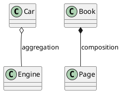
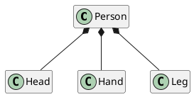
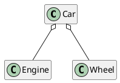

[UP](/uml.html)

在 UML 中，聚合（Aggregation）和组合（Composition）都是表示类之间关系的方式，它们之间的主要区别在于关联对象之间的生命周期和强度。

1. **聚合（Aggregation）**：
    - 表示的是一种弱的拥有关系，被聚合的对象可以独立存在，即使与聚合对象断开关联，它们仍然可以存在。
    - 聚合关系通常用一条带有空心菱形箭头的线表示，箭头指向被聚合的类。

2. **组合（Composition）**：
    - 表示的是一种强的拥有关系，被组合的对象的生命周期与组合对象的生命周期相依赖，即组合对象不存在时，被组合对象也不存在。
    - 组合关系通常用一条带实心菱形箭头的线表示，箭头指向被组合的类。

总的来说，聚合关系是一种弱关系，表示整体和部分之间的关联，而组合关系是一种强关系，表示整体拥有并且负责管理部分对象。

```text
                                    ┌─── implements
                ┌─── Inheritance ───┤
                │                   └─── extends
Relationship ───┤
                │                   ┌─── Aggregation (Weak)
                └─── Association ───┤
                                    └─── Composition (Strong)
```


In Object-Oriented Programming, there are many different types of **relationships**
which can exist between two or more classes.
The most common two types are:

- **Inheritance** — an **is a** relationship
- **Association** — a **has a** relationship

## Association

What is an Association relationship?

An association relationship between two classes is a "has a" relationship. For example:

- A **Car** has an **Engine** and a **Wheel**
- A **Person** has a **Leg** and an **Arm**
- A **Book** has **Pages**

This usually represents when there are two classes, `ClassA` and `ClassB`, and either:

- `ClassA` contains `ClassB` as an attribute, or
- Instances of `ClassB` are constructed inside `ClassA`

## Aggregation and Composition

What's the difference between Aggregation and Composition?

There are two subtypes of **Association** relationships — **Aggregation** and **Composition**.
What's the difference between these two?

### Composition

**Composition** implies that the contained class cannot exist independently of the container.
If the container is destroyed, the child is also destroyed.

Take for example a `Page` and a `Book`.
The `Page` cannot exist without the `Book`, because the book is composed of Pages.
If the `Book` is destroyed, the `Page` is also destroyed.

### Aggregation

With an **aggregation**, the child can exist independently of the parent.

So thinking of a `Car` and an `Engine`, the `Engine` doesn't need to be destroyed when the `Car` is destroyed.

## UML 图

How are these represented a UML diagram?

In a UML diagram, both Aggregation and Composition are represented with a diamond arrow between the classes.
The diamond end goes on the side of the container.

- **Aggregation** uses an open diamond
- **Composition** uses a closed diamond










## Reference

- [Aggregation vs. Composition in Object-Oriented Programming](https://medium.com/swlh/aggregation-vs-composition-in-object-oriented-programming-3fa4fd471a9f)
